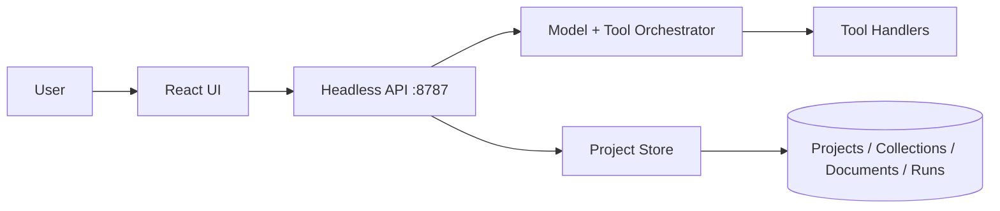

# Open Analyst Architecture, Capability Map, Status, and TODO

Last updated: 2026-02-14

## 1) Architecture Summary

Open Analyst is a headless-first system with two runtime parts:

- `src/renderer` (React/Vite UI)
- `scripts/headless-server.js` (HTTP backend + agent tool loop)

The UI calls the headless API directly. There is no Electron main/preload runtime path.

## 2) High-Level System Map

## 3) Repository Map

- `src/renderer`
  - `App.tsx`: root app shell
  - `store/index.ts`: global app state
  - `hooks/useIPC.ts`: headless orchestration adapter
  - `components/Sidebar.tsx`: project/task sidebar
  - `components/WelcomeView.tsx`: project dashboard and task start
  - `components/ChatView.tsx`: analyst chat
  - `components/ContextPanel.tsx`: plan/progress/resources/evidence panel
  - `components/ProjectWorkspace.tsx`: collections, source viewer, RAG search
  - `components/SettingsPanel.tsx`: API/credentials/MCP/skills/logs
  - `utils/headless-api.ts`: HTTP client for all headless endpoints

- `scripts`
  - `scripts/headless-server.js`: API endpoints, tool handlers, chat execution loop
  - `scripts/headless/project-store.js`: persistent JSON-backed project data store

- `tests`
  - UI/text/path/headless store behavior tests (Vitest)

## 4) Data and Domain Model

Project model (per project):
- Project metadata (`id`, `name`, `description`, timestamps)
- Datastores list (currently local default)
- Collections
- Documents (sources)
- Runs (task/session execution records)
- Run events (planner/tool/model lifecycle events)

UI state model (client):
- Projects and active project
- Sessions and per-session messages
- Session-to-project mapping
- Session-to-run mapping
- Session plan snapshots
- Active collection per project (used for chat ingestion target)

## 5) HTTP API Map (Complete)

### Core Runtime

- `GET /health`
- `GET /config`
- `POST /config`
- `GET /workdir`
- `POST /workdir`
- `GET /tools`
- `POST /chat`

### Projects / Collections / Documents / RAG / Runs

- `GET /projects`
- `POST /projects`
- `POST /projects/active`
- `GET /projects/:projectId`
- `PATCH /projects/:projectId`
- `DELETE /projects/:projectId`
- `GET /projects/:projectId/collections`
- `POST /projects/:projectId/collections`
- `GET /projects/:projectId/documents`
- `POST /projects/:projectId/documents`
- `POST /projects/:projectId/import/url`
- `POST /projects/:projectId/rag/query`
- `GET /projects/:projectId/runs`
- `GET /projects/:projectId/runs/:runId`

### Credentials

- `GET /credentials`
- `POST /credentials`
- `PATCH /credentials/:id`
- `DELETE /credentials/:id`

### MCP

- `GET /mcp/presets`
- `GET /mcp/servers`
- `POST /mcp/servers`
- `DELETE /mcp/servers/:id`
- `GET /mcp/status`
- `GET /mcp/tools`

### Skills

- `GET /skills`
- `POST /skills/validate`
- `POST /skills/install`
- `DELETE /skills/:id`
- `POST /skills/:id/enabled`

### Logs

- `GET /logs`
- `GET /logs/enabled`
- `POST /logs/enabled`
- `POST /logs/export`
- `POST /logs/clear`

### Debug

- `GET /debug/store`

## 6) Complete Capability Map

### A) Project-Oriented Workspace

- Create/select/rename/delete projects
- Task history per project
- Reopen prior tasks
- Persist project context and project-specific resources

### B) Task / Analyst Workflow

- Start task from project dashboard
- Continue task in chat
- Track execution traces and run events
- Right panel context shows plan/resources/evidence

### C) Collections and Sources

- Create collections in a project
- Add manual source documents
- Import URL as source
- View source content in source viewer
- Choose active collection in chat

### D) Deep Search / Retrieval

- Query documents through `rag/query`
- Filter by collection
- Result snippets with scoring

### E) Tool-Using Agent

Tool set:
- `deep_research`
- `list_directory`
- `read_file`
- `write_file`
- `edit_file`
- `glob`
- `grep`
- `execute_command`
- `web_fetch`
- `web_search`
- `arxiv_search`
- `hf_daily_papers`
- `hf_paper`

Tool behaviors:
- Workspace-safe path resolution for file tools
- Web/PDF/text capture support
- Multi-step deep research report generation with cited sources
- Automatic source capture into project collection context
- arXiv + Hugging Face paper ingestion

### F) Skills

Default builtin skills:
- `Web Research` (web search/fetch/arXiv/HF)
- `Code Operations` (file + command tools)

Custom skill capabilities:
- Validate folder (`SKILL.md` required)
- Install skill by path
- Enable/disable skill
- Delete skill

### G) MCP Connectors

MCP preset support:
- Filesystem
- Fetch
- GitHub

MCP management:
- Add/remove server configs
- Enable/disable servers
- View server status and exposed tool counts

### H) Credentials and Logs

Credentials:
- CRUD stored credentials

Logs:
- Toggle dev logs
- List log files
- Export logs bundle
- Clear logs

## 7) Current Status View

### Working and Verified

- Headless-only runtime path active
- Project-first flow in sidebar/dashboard
- Task chat with trace updates
- Collection/source management UI
- Active collection selection in chat
- Automatic source capture from fetch/arXiv/HF tools
- RAG query endpoint and UI usage
- Settings tabs functional in headless mode (API, credentials, MCP, skills, logs)
- Build passes: `npm run build`
- Tests pass: `npm test -- --run`

### Known Gaps / Constraints

- Document persistence currently JSON-file based (single-node, not multi-writer)
- Embedding/indexing quality is lightweight lexical matching, not vector DB-grade retrieval
- Custom skill install is path-based and minimal validation
- MCP tool execution path is config/status/tool-list oriented; deeper live MCP execution hardening can be expanded
- File attachment handling in browser mode is metadata-based; full binary ingestion pipeline can be further improved

## 8) TODO List (Prioritized)

### P0 (High Priority)

1. Replace lightweight retrieval with production vector indexing
2. Add robust ingestion pipeline (chunking, MIME-aware parsers, dedupe, metadata normalization)
3. Implement per-project datastore backends (`local`, `s3`, extensible interface)
4. Add migration-safe persistent DB (SQLite/Postgres) for projects/runs/docs
5. Add end-to-end UI integration tests (project/task/collection/source lifecycle)

### P1 (Important)

1. Expand run-event schema for richer planner timeline and artifact provenance
2. Improve source viewer for PDF/HTML previews with citation anchors
3. Add advanced collection manager operations (move docs, bulk import/export, tagging)
4. Add MCP health checks and retry/error diagnostics in UI
5. Add role-based/API-key scoping and stronger secret handling controls

### P2 (Enhancements)

1. Add background ingestion jobs and progress queues
2. Add project templates and reusable skill packs
3. Add compare/merge views across collections
4. Add observability dashboard for performance and tool reliability

## 9) Validation and Success Criteria

Current baseline validation:
- Unit/integration tests pass
- Production build passes
- No Electron runtime references in active source paths

Success criteria for next milestone:
- Full project lifecycle works from UI only
- Tool-driven source ingestion consistently lands in selected collection
- RAG returns collection-scoped, source-attributed results
- Settings pages are fully usable with no hidden/manual API calls
- Regression suite includes project/task/source/MCP/skills/logs paths
