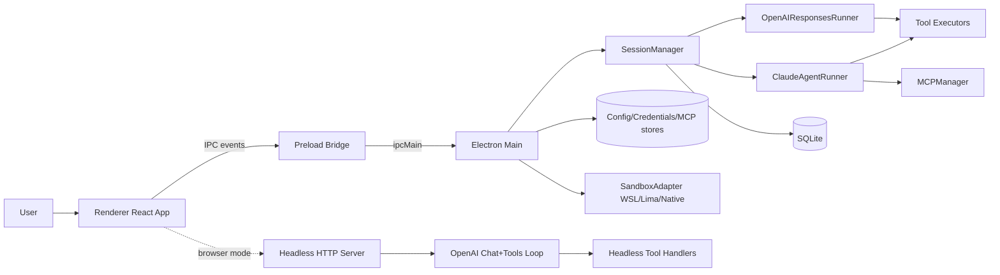

# Open Analyst Architecture Map

Last generated: 2026-02-14

This document maps the current repository architecture, runtime topology, major data/control flows, features, tools, and capabilities.

## 1) System Summary

Open Analyst is a local-first analyst assistant with two runtime modes:

1. Desktop mode (Electron): full main/preload/renderer architecture with IPC.
2. Container/headless mode: browser renderer talks to a local HTTP headless service for chat + tool execution.

Core characteristics:

- Session-oriented chat and trace model persisted in SQLite.
- Dual model runtimes: Claude Agent SDK runner and OpenAI Responses/Chat runner.
- Built-in tool execution layer with workspace path constraints.
- Optional sandboxing with WSL (Windows), Lima (macOS), and native fallback.
- MCP (Model Context Protocol) server integration for external tools/connectors.
- Skills system for structured task workflows.

## 2) Repo Topology

Primary source areas:

- `src/main`: Electron main process and backend domain modules.
- `src/preload`: secure renderer bridge (`window.electronAPI`).
- `src/renderer`: React UI, store, IPC hooks, components, utilities.
- `scripts`: build/runtime preparation and headless server.
- `tests`: Vitest tests for utility and behavior coverage.
- `.claude/skills`: built-in skills (`docx`, `pdf`, `pptx`, `xlsx`, `skill-creator`).

## 3) High-Level Runtime Diagram



## 4) Process & Module Architecture

### 4.1 Electron Main Process (`src/main/index.ts`)

Responsibilities:

- App lifecycle and BrowserWindow setup.
- Security guards for external navigation (`setWindowOpenHandler`, `will-navigate`).
- Config loading (`.env` + persisted config application).
- Core manager initialization:
  - `initDatabase()`
  - `new SkillsManager(...)`
  - `new SessionManager(...)`
- Working directory bootstrap and updates.
- Sandbox bootstrap start and progress relays.
- IPC API registration for all app features.

Notable behaviors:

- `ENABLE_REMOTE_CONTROL = false`; remote IPC endpoints are stubs returning disabled.
- Startup currently forces `sandboxEnabled = false` before bootstrap.
- On app shutdown: sync/cleanup WSL and Lima sandbox sessions.

### 4.2 Preload Bridge (`src/preload/index.ts`)

Provides typed `window.electronAPI` surface to renderer:

- Generic event send/receive/invoke.
- Window controls.
- Dialog/shell helpers.
- Namespaced APIs: `config`, `mcp`, `credentials`, `skills`, `sandbox`, `logs`, `remote`.

Listener model ensures a single active renderer callback registration.

### 4.3 Renderer Application (`src/renderer`)

- Root: `App.tsx` selects `WelcomeView` vs `ChatView` based on active session.
- State: Zustand store (`store/index.ts`) holds sessions, messages, trace, UI flags, config, workdir, sandbox progress.
- Orchestration: `hooks/useIPC.ts` routes IPC server events into store mutations and exposes high-level actions.
- Components:
  - Session UX: `Sidebar`, `WelcomeView`, `ChatView`, `MessageCard`, `ContextPanel`.
  - Controls/modals: `ConfigModal`, `SettingsPanel`, `PermissionDialog`.
  - Sandbox UX: `SandboxSetupDialog`, `SandboxSyncToast`.
  - Integrations UI: `CredentialsModal`, `MCPConnectorsModal`.
  - Window shell: `Titlebar`.

Browser/headless compatibility:

- `browser-config.ts` stores config in localStorage and performs direct browser API tests/chat fallback.
- `headless-api.ts` connects renderer to HTTP headless server.

## 5) Session Domain & Core Flow

### 5.1 SessionManager (`src/main/session/session-manager.ts`)

Owns session lifecycle:

- Create/list/load/update/delete sessions.
- Prompt queueing per session (`promptQueues`) with sequential processing.
- Active session cancellation control (`activeSessions`).
- Message and trace persistence.
- Permission request wait/resume bridge.
- AskUserQuestion response handoff to runner.
- Session title generation first-turn flow.

File attachment flow:

- File attachments are copied into `<session cwd>/.tmp`.
- If sandbox sync exists, attachment copied to sandbox mirror too.
- Prompt is enhanced with attached-file path hints.

### 5.2 Title Generation Flow

- Utilities: `session-title-utils.ts`
- Orchestrator: `session-title-flow.ts`
- Triggered only first user turn if title is default-like and not already attempted.

## 6) Model Runners

### 6.1 Claude Runner (`src/main/claude/agent-runner.ts`)

Key capabilities:

- Streaming via `@anthropic-ai/claude-agent-sdk` query pipeline.
- SDK session cache per app session (`sdkSessions`).
- MCP tool context prompt injection.
- Saved credentials prompt injection (actual credentials passed to model context).
- Skills discovery across built-in/global/project paths and skill-priority resolution.
- AskUserQuestion interception and synchronous wait for user answers.
- Trace step creation and updates for tool call/result lifecycle.
- Artifact extraction from assistant text blocks.

Sandbox integration:

- WSL flow: initializes `SandboxSync`, copies project and skills into isolated path, reports sync phases to renderer.
- Lima flow: similar via `LimaSync`.

### 6.2 OpenAI Runner (`src/main/openai/responses-runner.ts`)

Key capabilities:

- Supports `responses` mode and `chat` mode.
- Tool-call loop with max turns and fallback strategies for incompatible providers.
- Optional streaming responses with non-stream fallback.
- Tool execution plumbing through `ToolExecutor`.
- Permission gating and allow-always memory.
- Built-in TodoWrite/TodoRead in-memory task list.
- AskUserQuestion wait/resume flow.
- Artifact extraction and trace emission.

## 7) Tool Execution Architecture

### 7.1 Native ToolExecutor (`src/main/tools/tool-executor.ts`)

Implements workspace-scoped operations:

- `readFile`, `writeFile`, `editFile`, `listDirectory`, `glob`, `grep`, `executeCommand`, `webFetch`, `webSearch`.

Security constraints:

- Path resolution through mount-aware resolver + mount boundary validation.
- Command sandbox checks for cwd confinement, traversal blocks, dangerous pattern blocks, and absolute-path checks.

### 7.2 Sandbox Tool Executor (`src/main/tools/sandbox-tool-executor.ts`)

Equivalent tool surface, but delegates operations to `SandboxAdapter` (WSL/Lima/native backend).

## 8) Sandbox Subsystem

### 8.1 Adapter Layer (`src/main/sandbox/sandbox-adapter.ts`)

- Mode selection by platform/config: `wsl | lima | native`.
- Initialization and fallback dialogs.
- Unified executor interface:
  - command exec
  - file IO
  - directory listing
  - path conversion
- Optional `runClaudeCode` support in WSL/Lima modes.

### 8.2 Bootstrap Service (`src/main/sandbox/sandbox-bootstrap.ts`)

Background startup preflight and installation flow:

- WSL checks + install Node/Python/pip/deps.
- Lima checks + create/start VM + install Node/Python.
- Progress events emitted to renderer.
- Cached status for adapter fast path.

### 8.3 Platform Bridges

- `wsl-bridge.ts`: WSL status detection, installs, JSON-RPC agent process management.
- `lima-bridge.ts`: Lima status detection, VM lifecycle, installs, JSON-RPC agent process management.
- `native-executor.ts`: local non-VM fallback execution with workspace and command guards.

### 8.4 Sync Mirrors

- `sandbox-sync.ts`: Windows <-> WSL rsync lifecycle per session.
- `lima-sync.ts`: macOS <-> Lima rsync lifecycle per session.

### 8.5 Path Security

- `path-resolver.ts`: session mount registration, virtual-to-real mapping, traversal/symlink safety checks.
- `path-guard.ts`: additional denylist/pattern validation utility.

## 9) MCP Integration Architecture

### 9.1 MCP Manager (`src/main/mcp/mcp-manager.ts`)

Responsibilities:

- Store active clients/transports/processes/tool registry.
- Initialize/update/remove server connections.
- Resolve and launch stdio server commands (bundled node awareness).
- SSE transport support.
- Tool discovery (`listTools`) and prefixed naming: `mcp__<ServerName>__<toolName>`.
- Tool invocation with retry and timeout handling.
- Server health/status summary.

### 9.2 MCP Config Store (`src/main/mcp/mcp-config-store.ts`)

- Persists server list.
- Provides presets:
  - `chrome`
  - `notion`
  - `software-development`
  - `gui-operate`
- Resolves packaged/development paths for built-in MCP server scripts.

### 9.3 Built-in MCP Servers

- `gui-operate-server.ts`: cross-platform GUI automation + vision-assisted operations.
- `software-dev-server-example.ts`: requirement tracking + GUI app test/interaction utilities.

## 10) Persistence & State

### 10.1 SQLite (`src/main/db/database.ts`)

Tables:

- `sessions`
- `messages`
- `trace_steps`
- `memory_entries`
- `skills`

Key behavior:

- Session/message/trace read-write APIs with prepared statements.
- CASCADE delete from sessions to messages/trace.

### 10.2 Electron Stores

- App config store (`config-store.ts`, encrypted store).
- MCP server config store (`mcp-config-store.ts`).
- Credentials store (`credentials-store.ts`) + separate key store.

### 10.3 Credentials Security

- Passwords encrypted with AES-256-CBC before persistence.
- Safe list endpoints omit password payloads for UI listings.

## 11) Renderer UX Feature Map

User-facing capabilities in current implementation:

- Session creation/continuation/deletion.
- Real-time assistant streaming and structured tool/result rendering.
- File attach + image paste in prompt flow.
- Permission approvals and AskUserQuestion answer UX.
- Working-directory selection and display.
- Context panel with progress, tools used, artifacts, MCP status.
- Provider/API settings with live connection tests.
- Sandbox setup and sync status overlays.
- Credentials manager (CRUD).
- MCP connectors manager (preset/custom server management).
- Skills manager (list/install/enable/disable/delete/validate).
- Logs manager (list/export/open/clear/toggle dev logs).

## 12) Container / Headless Mode

Headless server (`scripts/headless-server.js`) provides:

- Config persistence (`~/.config/open-analyst/headless-config.json`).
- Working directory persistence (`local` and `s3://` markers).
- OpenAI chat + function-calling tool loop.
- Workspace-constrained file/command tools.

Endpoints:

- `GET /health`
- `GET /config`
- `POST /config`
- `GET /workdir`
- `POST /workdir`
- `GET /tools`
- `POST /chat`

Limitations noted in code/docs:

- S3 workdir values can be stored, but execution against S3 is not implemented.

## 13) Security & Boundary Model

Current controls:

- Context isolation (`contextIsolation: true`) in Electron.
- Explicit external link handling via OS browser.
- IPC-only privileged actions through preload API.
- Workspace path validation in tool executors.
- Command danger-pattern filtering.
- Optional WSL/Lima isolation with sync mirror model.
- Runtime remote-control pathways disabled in this build.

Residual risk notes:

- Native mode executes on host directly (with guards, but less isolated than VM/WSL).
- Headless mode tool execution may run shell commands within configured working dir.

## 14) Build, Packaging, and Runtime Tooling

Build/runtime stack:

- Vite + React + `vite-plugin-electron`.
- TypeScript for main/preload/renderer and sandbox agents.
- Tailwind CSS theme layer.

Scripts:

- Dev desktop: `npm run dev`
- Headless service: `npm run serve:headless`
- Container renderer: `npm run dev:container`
- Combined stack: `npm run dev:container:stack`
- Full container dev prep: `npm run dev:container:full`
- Build app: `npm run build`
- Build container renderer only: `npm run build:container`

Preparation helpers:

- `scripts/download-node.js` (bundled node runtimes)
- `scripts/prepare-python.js` (bundled Python runtime/deps)
- `scripts/prepare-gui-tools.js` (bundled GUI helper binaries)
- `scripts/bundle-mcp.js` (MCP server bundling)

## 15) Testing Coverage Map

Current tests cover:

- Session title policy/flow.
- Artifact parser and artifact UI mapping.
- File link parsing and rendering assumptions.
- Session update behavior in renderer state utility.
- MCP prefixed tool-name parsing.
- Claude env override behavior.
- Thinking-option config helper.
- Settings panel layout constraints.
- Tool-output path extraction.

---

## Appendix A: Feature / Capability Index

### A.1 End-user features

- Chat-based analyst workflow with session history and trace visualization.
- Provider switching: OpenRouter / Anthropic / OpenAI / Custom.
- API connectivity test and model selection.
- MCP connector management and MCP tool usage.
- Credentials vault for agent-assisted login tasks.
- Skills discovery/installation/toggling.
- Sandbox setup and per-session sandbox file synchronization.
- Log management with export.
- Headless/browser operation for containerized usage.

### A.2 Backend capabilities

- Multi-runner architecture (Claude SDK + OpenAI APIs).
- Tool-call loops with permission workflows and question-response cycles.
- SQLite-backed persistent sessions/messages/trace.
- MCP lifecycle and tool routing.
- Optional WSL/Lima isolation and sync mirroring.

### A.3 Tool capability classes

- File ops: read/write/edit/list/glob/grep.
- Command exec: shell command in scoped workspace.
- Web ops: fetch/search (DuckDuckGo-backed search in built-ins).
- Interaction ops: AskUserQuestion, TodoRead/TodoWrite.
- MCP ops: large externally-provided tool surface.

---

## Appendix B: Machine-Generated Inventory Snapshots

The following sections are generated from repository scans at document generation time.

### B.1 Files (`find src -maxdepth 3 -type f | sort`)

```text
src/main/claude/agent-runner.ts
src/main/claude/claude-env.ts
src/main/claude/thinking-options.ts
src/main/config/api-tester.ts
src/main/config/config-store.ts
src/main/credentials/credentials-store.ts
src/main/db/database.ts
src/main/index.ts
src/main/mcp/gui-operate-server.ts
src/main/mcp/mcp-config-store.ts
src/main/mcp/mcp-logger.ts
src/main/mcp/mcp-manager.ts
src/main/mcp/software-dev-server-example.ts
src/main/memory/memory-manager.ts
src/main/openai/responses-runner.ts
src/main/sandbox/index.ts
src/main/sandbox/lima-bridge.ts
src/main/sandbox/lima-sync.ts
src/main/sandbox/native-executor.ts
src/main/sandbox/path-guard.ts
src/main/sandbox/path-resolver.ts
src/main/sandbox/sandbox-adapter.ts
src/main/sandbox/sandbox-bootstrap.ts
src/main/sandbox/sandbox-sync.ts
src/main/sandbox/types.ts
src/main/sandbox/wsl-bridge.ts
src/main/session/session-manager.ts
src/main/session/session-title-flow.ts
src/main/session/session-title-utils.ts
src/main/skills/skills-manager.ts
src/main/tools/sandbox-tool-executor.ts
src/main/tools/tool-executor.ts
src/main/utils/artifact-parser.ts
src/main/utils/logger.ts
src/preload/index.ts
src/renderer/App.tsx
src/renderer/components/ChatView.tsx
src/renderer/components/ConfigModal.tsx
src/renderer/components/ContextPanel.tsx
src/renderer/components/CredentialsModal.tsx
src/renderer/components/LanguageSwitcher.tsx
src/renderer/components/MCPConnectorsModal.tsx
src/renderer/components/MessageCard.tsx
src/renderer/components/PermissionDialog.tsx
src/renderer/components/SandboxSetupDialog.tsx
src/renderer/components/SandboxSyncToast.tsx
src/renderer/components/SettingsPanel.tsx
src/renderer/components/Sidebar.tsx
src/renderer/components/Titlebar.tsx
src/renderer/components/TracePanel.tsx
src/renderer/components/WelcomeView.tsx
src/renderer/components/index.ts
src/renderer/hooks/useIPC.ts
src/renderer/main.tsx
src/renderer/shims/react-i18next.ts
src/renderer/store/index.ts
src/renderer/styles/globals.css
src/renderer/text/en.json
src/renderer/types/index.ts
src/renderer/utils/artifact-path.ts
src/renderer/utils/artifact-steps.ts
src/renderer/utils/browser-config.ts
src/renderer/utils/file-link.ts
src/renderer/utils/headless-api.ts
src/renderer/utils/session-update.ts
src/renderer/utils/tool-output-path.ts
```

### B.2 Exported Symbols (`rg -n "^export ..."`)

```text
src/main/claude/agent-runner.ts:118:export class ClaudeAgentRunner {
src/main/claude/claude-env.ts:16:export function getClaudeEnvOverrides(config: AppConfig): NodeJS.ProcessEnv {
src/main/claude/claude-env.ts:47:export function buildClaudeEnv(
src/main/claude/thinking-options.ts:1:export type ThinkingOptions =
src/main/claude/thinking-options.ts:5:export function buildThinkingOptions(enableThinking: boolean): ThinkingOptions {
src/main/config/config-store.ts:287:export const configStore = new ConfigStore();
src/main/config/config-store.ts:57:export const PROVIDER_PRESETS = {
src/main/config/config-store.ts:7:export interface AppConfig {
src/main/credentials/credentials-store.ts:275:export const credentialsStore = new CredentialsStore();
src/main/credentials/credentials-store.ts:8:export interface UserCredential {
src/main/db/database.ts:12:export interface DatabaseInstance {
src/main/db/database.ts:209:export function initDatabase(): DatabaseInstance {
src/main/db/database.ts:422:export function getDatabase(): DatabaseInstance {
src/main/db/database.ts:432:export function closeDatabase(): void {
src/main/db/database.ts:47:export interface SessionRow {
src/main/db/database.ts:60:export interface MessageRow {
src/main/db/database.ts:69:export interface TraceStepRow {
src/main/mcp/mcp-config-store.ts:10:export const MCP_SERVER_PRESETS: Record<string, Omit<MCPServerConfig, 'id' | 'enabled'> & { requiresEnv?: string[]; envDescription?: Record<string, string> }> = {
src/main/mcp/mcp-config-store.ts:246:export const mcpConfigStore = new MCPConfigStore();
src/main/mcp/mcp-logger.ts:98:export function writeMCPLog(content: string, label?: string): void {
src/main/mcp/mcp-manager.ts:11:export interface MCPServerConfig {
src/main/mcp/mcp-manager.ts:26:export interface MCPTool {
src/main/mcp/mcp-manager.ts:41:export class MCPManager {
src/main/memory/memory-manager.ts:18:export class MemoryManager {
src/main/openai/responses-runner.ts:336:export class OpenAIResponsesRunner {
src/main/sandbox/index.ts:11:export { SandboxAdapter, getSandboxAdapter, initializeSandbox, shutdownSandbox } from './sandbox-adapter';
src/main/sandbox/index.ts:12:export type { SandboxMode, SandboxAdapterConfig } from './sandbox-adapter';
src/main/sandbox/index.ts:15:export { WSLBridge, pathConverter } from './wsl-bridge';
src/main/sandbox/index.ts:16:export { LimaBridge, limaPathConverter } from './lima-bridge';
src/main/sandbox/index.ts:17:export { NativeExecutor } from './native-executor';
src/main/sandbox/index.ts:20:export { PathResolver } from './path-resolver';
src/main/sandbox/index.ts:23:export { SandboxSync } from './sandbox-sync';
src/main/sandbox/index.ts:24:export type { SyncSession, SyncResult } from './sandbox-sync';
src/main/sandbox/index.ts:25:export { PathGuard } from './path-guard';
src/main/sandbox/index.ts:26:export type { ValidationResult } from './path-guard';
src/main/sandbox/lima-bridge.ts:110:export const pathConverter = limaPathConverter;
src/main/sandbox/lima-bridge.ts:115:export class LimaBridge implements SandboxExecutor {
src/main/sandbox/lima-bridge.ts:88:export const limaPathConverter: PathConverter = {
src/main/sandbox/lima-sync.ts:25:export interface LimaSyncSession {
src/main/sandbox/lima-sync.ts:35:export interface LimaSyncResult {
src/main/sandbox/lima-sync.ts:67:export class LimaSync {
src/main/sandbox/native-executor.ts:22:export class NativeExecutor implements SandboxExecutor {
src/main/sandbox/path-guard.ts:13:export interface ValidationResult {
src/main/sandbox/path-guard.ts:75:export class PathGuard {
src/main/sandbox/path-resolver.ts:14:export class PathResolver {
src/main/sandbox/sandbox-adapter.ts:31:export type SandboxMode = 'wsl' | 'lima' | 'native' | 'none';
src/main/sandbox/sandbox-adapter.ts:33:export interface SandboxAdapterConfig extends SandboxConfig {
src/main/sandbox/sandbox-adapter.ts:53:export class SandboxAdapter implements SandboxExecutor {
src/main/sandbox/sandbox-adapter.ts:678:export function getSandboxAdapter(): SandboxAdapter {
src/main/sandbox/sandbox-bootstrap.ts:15:export type SandboxSetupPhase = 
src/main/sandbox/sandbox-bootstrap.ts:27:export interface SandboxSetupProgress {
src/main/sandbox/sandbox-bootstrap.ts:35:export interface SandboxBootstrapResult {
src/main/sandbox/sandbox-bootstrap.ts:428:export function getSandboxBootstrap(): SandboxBootstrap {
src/main/sandbox/sandbox-bootstrap.ts:49:export class SandboxBootstrap {
src/main/sandbox/sandbox-sync.ts:24:export interface SyncSession {
src/main/sandbox/sandbox-sync.ts:35:export interface SyncResult {
src/main/sandbox/sandbox-sync.ts:67:export class SandboxSync {
src/main/sandbox/types.ts:12:export interface FileResult {
src/main/sandbox/types.ts:18:export interface DirectoryEntry {
src/main/sandbox/types.ts:24:export interface SandboxConfig {
src/main/sandbox/types.ts:31:export interface JSONRPCRequest {
src/main/sandbox/types.ts:38:export interface JSONRPCResponse {
src/main/sandbox/types.ts:49:export interface WSLStatus {
src/main/sandbox/types.ts:5:export interface ExecutionResult {
src/main/sandbox/types.ts:60:export interface LimaStatus {
src/main/sandbox/types.ts:73:export interface SandboxExecutor {
src/main/sandbox/types.ts:87:export interface PathConverter {
src/main/sandbox/wsl-bridge.ts:44:export const pathConverter: PathConverter = {
src/main/sandbox/wsl-bridge.ts:93:export class WSLBridge implements SandboxExecutor {
src/main/session/session-manager.ts:26:export class SessionManager {
src/main/session/session-title-utils.ts:14:export function shouldGenerateTitle(input: TitleDecisionInput): boolean {
src/main/session/session-title-utils.ts:1:export type TitleDecisionInput = {
src/main/session/session-title-utils.ts:21:export function buildTitlePrompt(prompt: string): string {
src/main/session/session-title-utils.ts:8:export function getDefaultTitleFromPrompt(prompt: string): string {
src/main/skills/skills-manager.ts:30:export class SkillsManager {
src/main/tools/sandbox-tool-executor.ts:18:export class SandboxToolExecutor {
src/main/tools/tool-executor.ts:13:export class ToolExecutor {
src/main/utils/artifact-parser.ts:10:export type ArtifactParseResult = {
src/main/utils/artifact-parser.ts:17:export function extractArtifactsFromText(text: string): ArtifactParseResult {
src/main/utils/artifact-parser.ts:4:export type ArtifactInfo = {
src/main/utils/artifact-parser.ts:51:export function buildArtifactTraceSteps(
src/main/utils/logger.ts:163:export function log(...args: any[]): void {
src/main/utils/logger.ts:168:export function logWarn(...args: any[]): void {
src/main/utils/logger.ts:173:export function logError(...args: any[]): void {
src/main/utils/logger.ts:181:export function getLogFilePath(): string | null {
src/main/utils/logger.ts:191:export function getLogsDirectory(): string {
src/main/utils/logger.ts:199:export function getAllLogFiles(): Array<{ name: string; path: string; size: number; mtime: Date }> {
src/main/utils/logger.ts:228:export function setDevLogsEnabled(enabled: boolean): void {
src/main/utils/logger.ts:248:export function isDevLogsEnabled(): boolean {
src/main/utils/logger.ts:255:export function closeLogFile(): void {
src/renderer/components/ChatView.tsx:16:export function ChatView() {
src/renderer/components/ConfigModal.tsx:24:export function ConfigModal({ isOpen, onClose, onSave, initialConfig, isFirstRun }: ConfigModalProps) {
src/renderer/components/ContextPanel.tsx:37:export function ContextPanel() {
src/renderer/components/CredentialsModal.tsx:37:export function CredentialsModal({ isOpen, onClose }: CredentialsModalProps) {
src/renderer/components/CredentialsModal.tsx:6:export interface UserCredential {
src/renderer/components/LanguageSwitcher.tsx:4:export function LanguageSwitcher() {
src/renderer/components/MCPConnectorsModal.tsx:19:export interface MCPServerStatus {
src/renderer/components/MCPConnectorsModal.tsx:31:export function MCPConnectorsModal({ isOpen, onClose }: MCPConnectorsModalProps) {
src/renderer/components/MCPConnectorsModal.tsx:7:export interface MCPServerConfig {
src/renderer/components/MessageCard.tsx:40:export function MessageCard({ message, isStreaming }: MessageCardProps) {
src/renderer/components/PermissionDialog.tsx:15:export function PermissionDialog({ permission }: PermissionDialogProps) {
src/renderer/components/SandboxSetupDialog.tsx:28:export function SandboxSetupDialog({ progress, onComplete }: Props) {
src/renderer/components/SandboxSyncToast.tsx:29:export function SandboxSyncToast({ status }: Props) {
src/renderer/components/SettingsPanel.tsx:75:export function SettingsPanel({ isOpen, onClose, initialTab = 'api' }: SettingsPanelProps) {
src/renderer/components/Sidebar.tsx:17:export function Sidebar() {
src/renderer/components/Titlebar.tsx:6:export function Titlebar() {
src/renderer/components/TracePanel.tsx:17:export function TracePanel({ sessionId }: TracePanelProps) {
src/renderer/components/WelcomeView.tsx:19:export function WelcomeView() {
src/renderer/components/index.ts:1:export { Sidebar } from './Sidebar';
src/renderer/components/index.ts:2:export { WelcomeView } from './WelcomeView';
src/renderer/components/index.ts:3:export { ChatView } from './ChatView';
src/renderer/components/index.ts:4:export { MessageCard } from './MessageCard';
src/renderer/components/index.ts:5:export { ContextPanel } from './ContextPanel';
src/renderer/components/index.ts:6:export { PermissionDialog } from './PermissionDialog';
src/renderer/components/index.ts:7:export { MCPConnectorsModal } from './MCPConnectorsModal';
src/renderer/hooks/useIPC.ts:37:export function useIPC() {
src/renderer/shims/react-i18next.ts:47:export function useTranslation() {
src/renderer/store/index.ts:123:export const useAppStore = create<AppState>((set) => ({
src/renderer/types/index.ts:108:export type TraceStepType = 'thinking' | 'text' | 'tool_call' | 'tool_result';
src/renderer/types/index.ts:109:export type TraceStepStatus = 'pending' | 'running' | 'completed' | 'error';
src/renderer/types/index.ts:112:export interface Skill {
src/renderer/types/index.ts:122:export type SkillType = 'builtin' | 'mcp' | 'custom';
src/renderer/types/index.ts:125:export interface MemoryEntry {
src/renderer/types/index.ts:133:export interface MemoryMetadata {
src/renderer/types/index.ts:140:export interface PermissionRequest {
src/renderer/types/index.ts:147:export type PermissionResult = 'allow' | 'deny' | 'allow_always';
src/renderer/types/index.ts:150:export interface QuestionOption {
src/renderer/types/index.ts:155:export interface QuestionItem {
src/renderer/types/index.ts:15:export type SessionStatus = 'idle' | 'running' | 'completed' | 'error';
src/renderer/types/index.ts:162:export interface UserQuestionRequest {
src/renderer/types/index.ts:169:export interface UserQuestionResponse {
src/renderer/types/index.ts:174:export interface PermissionRule {
src/renderer/types/index.ts:17:export interface MountedPath {
src/renderer/types/index.ts:181:export type ClientEvent =
src/renderer/types/index.ts:198:export type SandboxSetupPhase = 
src/renderer/types/index.ts:210:export interface SandboxSetupProgress {
src/renderer/types/index.ts:219:export type SandboxSyncPhase =
src/renderer/types/index.ts:226:export interface SandboxSyncStatus {
src/renderer/types/index.ts:235:export type ServerEvent =
src/renderer/types/index.ts:23:export interface Message {
src/renderer/types/index.ts:253:export interface Settings {
src/renderer/types/index.ts:264:export type ToolName = 'read' | 'write' | 'edit' | 'glob' | 'grep' | 'bash' | 'webFetch' | 'webSearch';
src/renderer/types/index.ts:266:export interface ToolResult {
src/renderer/types/index.ts:273:export interface ExecutionContext {
src/renderer/types/index.ts:281:export interface AppConfig {
src/renderer/types/index.ts:295:export interface ProviderPreset {
src/renderer/types/index.ts:2:export interface Session {
src/renderer/types/index.ts:303:export interface ProviderPresets {
src/renderer/types/index.ts:310:export interface ApiTestInput {
src/renderer/types/index.ts:319:export interface ApiTestResult {
src/renderer/types/index.ts:336:export interface MCPServerInfo {
src/renderer/types/index.ts:33:export type MessageRole = 'user' | 'assistant' | 'system';
src/renderer/types/index.ts:344:export interface MCPToolInfo {
src/renderer/types/index.ts:35:export type ContentBlock =
src/renderer/types/index.ts:43:export interface TextContent {
src/renderer/types/index.ts:48:export interface ImageContent {
src/renderer/types/index.ts:57:export interface FileAttachmentContent {
src/renderer/types/index.ts:65:export interface ToolUseContent {
src/renderer/types/index.ts:72:export interface ToolResultContent {
src/renderer/types/index.ts:83:export interface ThinkingContent {
src/renderer/types/index.ts:88:export interface TokenUsage {
src/renderer/types/index.ts:94:export interface TraceStep {
src/renderer/utils/artifact-path.ts:1:export function resolveArtifactPath(pathValue: string, cwd?: string | null): string {
src/renderer/utils/artifact-steps.ts:110:export function getArtifactIconKey(filename: string): ArtifactIconKey {
src/renderer/utils/artifact-steps.ts:121:export function getArtifactIconComponent(filename: string): ArtifactIconComponent {
src/renderer/utils/artifact-steps.ts:147:export function getArtifactSteps(steps: TraceStep[]): ArtifactStepResult {
src/renderer/utils/artifact-steps.ts:18:export function getArtifactLabel(pathValue: string, name?: string): string {
src/renderer/utils/artifact-steps.ts:30:export type ArtifactIconKey =
src/renderer/utils/artifact-steps.ts:42:export type ArtifactIconComponent =
src/renderer/utils/browser-config.ts:103:export function saveBrowserConfig(
src/renderer/utils/browser-config.ts:120:export type BrowserChatMessage = {
src/renderer/utils/browser-config.ts:77:export function getBrowserConfig(): AppConfig {
src/renderer/utils/browser-config.ts:8:export const FALLBACK_PRESETS: ProviderPresets = {
src/renderer/utils/file-link.ts:113:export function splitChildrenByFileMentions(children: Array<unknown>): FileChildPart[] {
src/renderer/utils/file-link.ts:11:export function getFileLinkButtonClassName(): string {
src/renderer/utils/file-link.ts:1:export type FileTextPart =
src/renderer/utils/file-link.ts:47:export function splitTextByFileMentions(text: string): FileTextPart[] {
src/renderer/utils/file-link.ts:4:export type FileChildPart =
src/renderer/utils/headless-api.ts:52:export type HeadlessTraceStep = {
src/renderer/utils/headless-api.ts:7:export function getHeadlessApiBase(): string {
src/renderer/utils/session-update.ts:3:export function applySessionUpdate(
src/renderer/utils/tool-output-path.ts:6:export function extractFilePathFromToolOutput(toolOutput?: string): string | null {
```

### B.3 IPC Routes and Session Event Cases (`src/main/index.ts`)

```text
1023:ipcMain.handle('logs.setEnabled', async (_event, enabled: boolean) => {
1035:ipcMain.handle('logs.isEnabled', () => {
1050:ipcMain.handle('remote.getConfig', () => ({
1055:ipcMain.handle('remote.getStatus', () => ({
1062:ipcMain.handle('remote.setEnabled', async () => ({ success: false, error: remoteDisabledError }));
1063:ipcMain.handle('remote.updateGatewayConfig', async () => ({ success: false, error: remoteDisabledError }));
1064:ipcMain.handle('remote.updateFeishuConfig', async () => ({ success: false, error: remoteDisabledError }));
1065:ipcMain.handle('remote.getPairedUsers', () => []);
1066:ipcMain.handle('remote.getPendingPairings', () => []);
1067:ipcMain.handle('remote.approvePairing', () => ({ success: false, error: remoteDisabledError }));
1068:ipcMain.handle('remote.revokePairing', () => ({ success: false, error: remoteDisabledError }));
1069:ipcMain.handle('remote.getRemoteSessions', () => []);
1070:ipcMain.handle('remote.clearRemoteSession', () => ({ success: false, error: remoteDisabledError }));
1071:ipcMain.handle('remote.getTunnelStatus', () => ({ connected: false, url: null, provider: 'none', error: remoteDisabledError }));
1072:ipcMain.handle('remote.getWebhookUrl', () => null);
1073:ipcMain.handle('remote.restart', async () => ({ success: false, error: remoteDisabledError }));
1075:ipcMain.handle('logs.write', (_event, level: 'info' | 'warn' | 'error', args: any[]) => {
1091:ipcMain.handle('sandbox.retryLimaSetup', async () => {
1122:ipcMain.handle('sandbox.retrySetup', async () => {
1162:    case 'session.start':
1171:    case 'session.continue':
1178:    case 'session.stop':
1181:    case 'session.delete':
1184:    case 'session.list':
1189:    case 'session.getMessages':
1192:    case 'session.getTraceSteps':
1195:    case 'permission.response':
1201:    case 'question.response':
1207:    case 'folder.select':
1220:    case 'workdir.get':
1223:    case 'workdir.set':
1226:    case 'workdir.select':
1238:    case 'settings.update':
396:ipcMain.on('client-event', async (_event, data: ClientEvent) => {
408:ipcMain.handle('client-invoke', async (_event, data: ClientEvent) => {
412:ipcMain.handle('get-version', () => {
416:ipcMain.handle('shell.openExternal', async (_event, url: string) => {
424:ipcMain.handle('shell.showItemInFolder', async (_event, filePath: string) => {
432:ipcMain.handle('dialog.selectFiles', async () => {
446:ipcMain.handle('config.get', () => {
450:ipcMain.handle('config.getPresets', () => {
454:ipcMain.handle('config.save', (_event, newConfig: Partial<AppConfig>) => {
489:ipcMain.handle('config.isConfigured', () => {
493:ipcMain.handle('config.test', async (_event, payload: ApiTestInput): Promise<ApiTestResult> => {
507:ipcMain.handle('mcp.getServers', () => {
516:ipcMain.handle('mcp.getServer', (_event, serverId: string) => {
525:ipcMain.handle('mcp.saveServer', async (_event, config: MCPServerConfig) => {
540:ipcMain.handle('mcp.deleteServer', async (_event, serverId: string) => {
555:ipcMain.handle('mcp.getTools', () => {
568:ipcMain.handle('mcp.getServerStatus', () => {
581:ipcMain.handle('mcp.getPresets', () => {
591:ipcMain.handle('credentials.getAll', () => {
601:ipcMain.handle('credentials.getById', (_event, id: string) => {
610:ipcMain.handle('credentials.getByType', (_event, type: UserCredential['type']) => {
619:ipcMain.handle('credentials.getByService', (_event, service: string) => {
628:ipcMain.handle('credentials.save', (_event, credential: Omit<UserCredential, 'id' | 'createdAt' | 'updatedAt'>) => {
637:ipcMain.handle('credentials.update', (_event, id: string, updates: Partial<Omit<UserCredential, 'id' | 'createdAt' | 'updatedAt'>>) => {
646:ipcMain.handle('credentials.delete', (_event, id: string) => {
656:ipcMain.handle('skills.getAll', async () => {
670:ipcMain.handle('skills.install', async (_event, skillPath: string) => {
683:ipcMain.handle('skills.delete', async (_event, skillId: string) => {
696:ipcMain.handle('skills.setEnabled', async (_event, skillId: string, enabled: boolean) => {
709:ipcMain.handle('skills.validate', async (_event, skillPath: string) => {
723:ipcMain.on('window.minimize', () => {
727:ipcMain.on('window.maximize', () => {
735:ipcMain.on('window.close', () => {
740:ipcMain.handle('sandbox.getStatus', async () => {
784:ipcMain.handle('sandbox.checkWSL', async () => {
793:ipcMain.handle('sandbox.installNodeInWSL', async (_event, distro: string) => {
802:ipcMain.handle('sandbox.installPythonInWSL', async (_event, distro: string) => {
811:ipcMain.handle('sandbox.installClaudeCodeInWSL', async (_event, distro: string) => {
821:ipcMain.handle('sandbox.checkLima', async () => {
830:ipcMain.handle('sandbox.createLimaInstance', async () => {
839:ipcMain.handle('sandbox.startLimaInstance', async () => {
848:ipcMain.handle('sandbox.stopLimaInstance', async () => {
857:ipcMain.handle('sandbox.installNodeInLima', async () => {
866:ipcMain.handle('sandbox.installPythonInLima', async () => {
875:ipcMain.handle('sandbox.installClaudeCodeInLima', async () => {
885:ipcMain.handle('logs.getPath', () => {
894:ipcMain.handle('logs.getDirectory', () => {
903:ipcMain.handle('logs.getAll', () => {
912:ipcMain.handle('logs.export', async () => {
985:ipcMain.handle('logs.open', async () => {
996:ipcMain.handle('logs.clear', async () => {
```

### B.4 OpenAI Runner Tool Names (`src/main/openai/responses-runner.ts`)

```text
AskUserQuestion
TodoRead
TodoWrite
WebFetch
WebSearch
edit_file
execute_command
glob
grep
list_directory
read_file
write_file
```

### B.5 Headless Server Tool Names (`scripts/headless-server.js`)

```text
edit_file
execute_command
glob
grep
list_directory
read_file
web_fetch
web_search
write_file
```

### B.6 MCP GUI Operate Tool Names (`src/main/mcp/gui-operate-server.ts`)

```text
clear_click_history
click
drag
get_all_visited_apps
get_displays
get_mouse_position
gui_interact_vision
gui_locate_element
gui_plan_action
gui_verify_vision
init_app
key_press
move_mouse
screenshot
screenshot_for_display
scroll
type_text
wait
```

### B.7 MCP Software Dev Tool Names (`src/main/mcp/software-dev-server-example.ts`)

```text
create_requirement
get_docker_logs
gui_assert
gui_interact
gui_interact_vision
gui_verify_vision
list_requirements
read_code_file
start_gui_application
stop_gui_application
update_requirement
validate_requirement
```

## Appendix C: Regeneration Commands

```bash
find src -maxdepth 3 -type f | sort > /tmp/oa_files.txt

rg -n "^export (class|function|const|type|interface|\{)" \
  src/main src/preload src/renderer scripts | sort > /tmp/oa_exports.txt

rg -n "ipcMain\.(handle|on)\('([^']+)'|case '[^']+'" \
  src/main/index.ts | sort > /tmp/oa_ipc.txt

awk '/const TOOL_SPECS:/{flag=1} flag && /name: '\''/{print} /const TOOL_ALIASES:/{flag=0}' \
  src/main/openai/responses-runner.ts | sed "s/.*name: '\([^']*\)'.*/\1/" | sort -u > /tmp/oa_openai_tools_sorted.txt

awk '/const TOOL_DEFS = \[/{flag=1} flag && /name: '\''/{print} flag && /^\];/{exit}' \
  scripts/headless-server.js | sed "s/.*name: '\([^']*\)'.*/\1/" | sort -u > /tmp/oa_headless_tools_sorted.txt

awk 'NR>=4647 && NR<=5030 {print}' src/main/mcp/gui-operate-server.ts | rg "name: '" \
  | sed "s/.*name: '\([^']*\)'.*/\1/" | sort -u > /tmp/oa_mcp_gui_tools_sorted.txt

awk 'NR>=2080 && NR<=2335 {print}' src/main/mcp/software-dev-server-example.ts | rg "name: '" \
  | sed "s/.*name: '\([^']*\)'.*/\1/" | sort -u > /tmp/oa_mcp_softdev_tools_sorted.txt
```
